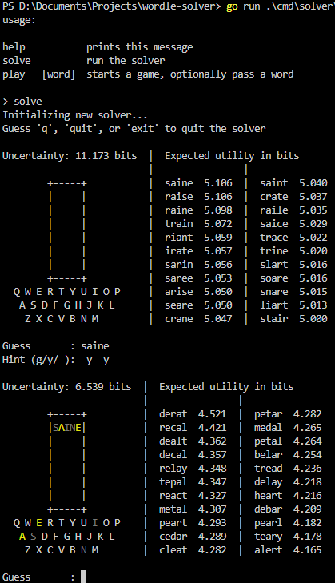

# wordle-solver

Created this Wordle solver on a whim due to playing daily puzzles with a friend.

## Methodology

### Wordle trees

The solver works by maintaining a tree of possible solutions and a tree of possible guesses, these are pruned after the user provides a guess.

### Constraints

Each guess (i.e., a word and a set of hints) yields a set of constraints, given the rules of Wordle:

- Green
  - Exclude all other possible letters at this position
  - Increment the minimum count for this letter
- Yellow
  - Exclude this letter at this position
  - Increment the minimum count for this letter
- Grey
  - If there exists a yellow of the same letter, exclude this letter from this position
  - If not, exclude this letter from all positions, unless it has a green of the same letter

#### Valid constraints

Not all constraints are possible, for instance, in Wordle yellows and greys of the same letter must be ordered. If a word contains two letters 'a' of which one is grey and one is yellow, the yellow must come before the grey. In reality, the ordering does not really matter, both variations convey the exact same information and we do not want to double count them.

### Word Utility

To compute the utility of a word, we compute the expected information gained from each of its possible hint patterns using Shannon entropy $H(X) = -\sum_x p(x) \log p(x)$

## Precomputation

Computing the initial set of possible constraints is a bit compute intensive, thus a precomputation step is added. The results are stored in the `assets` directory.

The precomputation can be reran with `go run ./cmd/solver/`

## Preview

